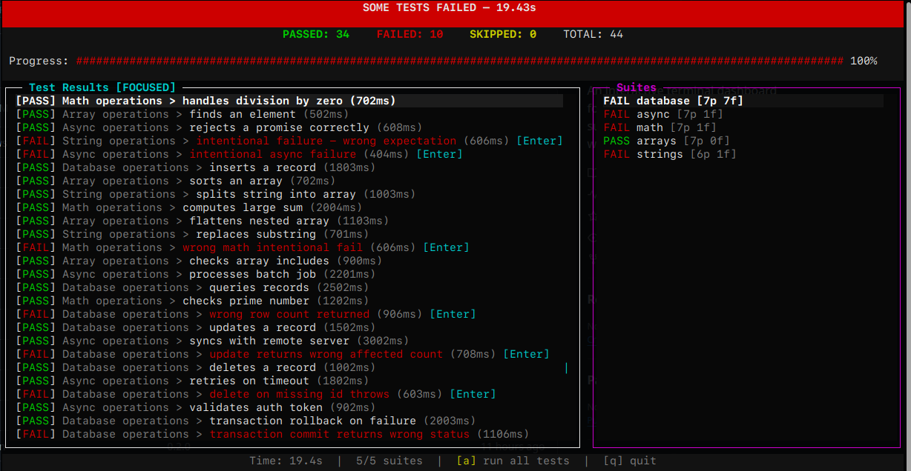
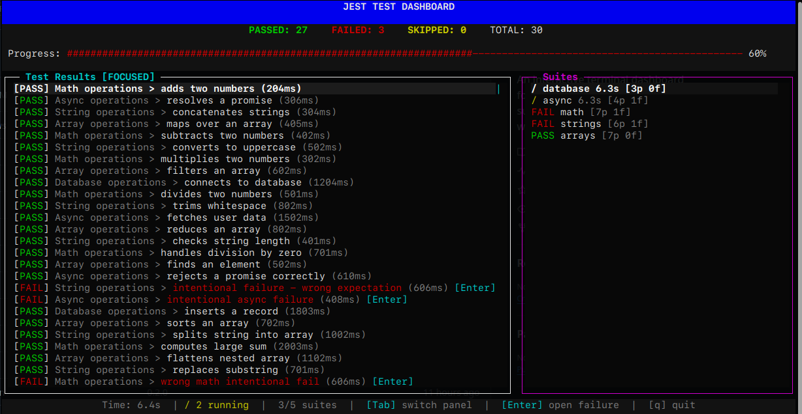
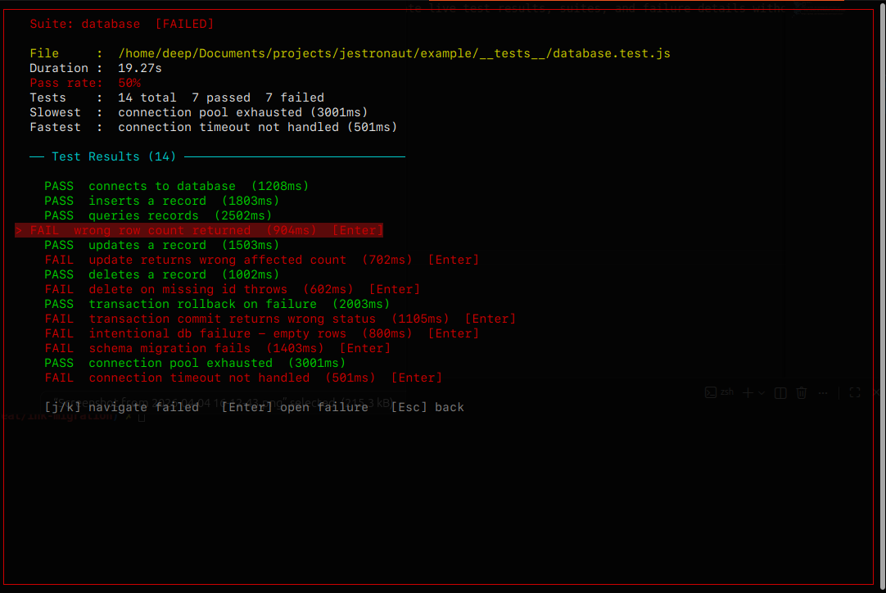
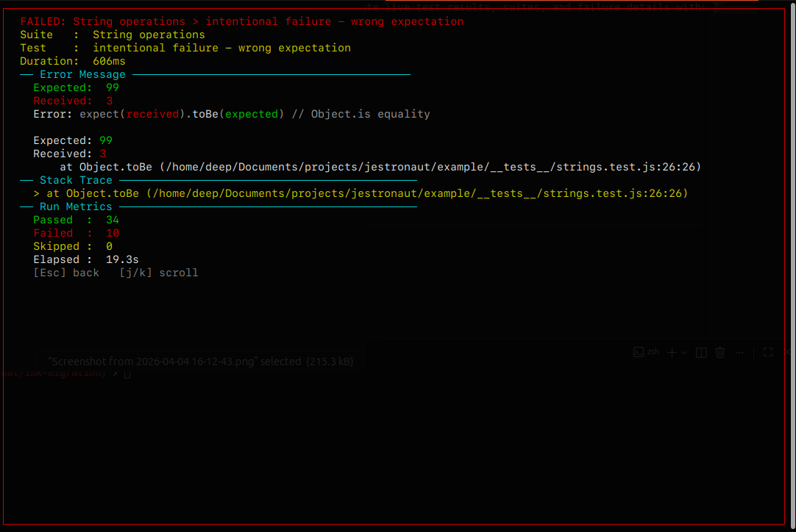

# Jestronaut 🚀

An interactive terminal dashboard for Jest — navigate live test results, suites, and failure stack traces without leaving your terminal.

[](https://www.npmjs.com/package/jestronaut)


## Screenshots

### Main Dashboard


### Watch Mode


### Suite Detail


### Failure Detail


## Features

- Live dashboard updates as tests run
- Animated spinner showing which suites are in progress
- Pass / Fail / Skip counters + progress bar
- Navigable test results panel with keyboard controls
- Navigable suites panel — open any suite to see its full breakdown
- Failure detail overlay with expected/received diff and stack trace
- Navigate between failed tests inside a suite with `j/k`
- Re-run failed tests with `r` (watch mode)
- Run all tests with `a` (watch mode)
- Help overlay with `?` showing all keybindings

## Install

```bash
npm install --save-dev jestronaut
```

## Setup

Add to your `jest.config.js`:

```js
module.exports = {
  reporters: ['jestronaut'],
  watchPlugins: ['jestronaut/watch-plugin'], // enables watch mode keybindings (r, a)
};
```

## Run

Instead of `jest`, use:

```bash
npx jestronaut
```

Or add to your `package.json` scripts:

```json
"scripts": {
  "test": "jestronaut"
}
```

All Jest CLI flags work as normal:

```bash
npx jestronaut --testPathPattern=auth
npx jestronaut --watch
```

## Keyboard Controls

| Key | Action |
|-----|--------|
| `Tab` | Switch focus between Test Results and Suites panels |
| `j` / `↓` | Move cursor down |
| `k` / `↑` | Move cursor up |
| `Enter` | Open failure detail (on a failed test) or suite detail (on a suite) |
| `Esc` | Close overlay / go back |
| `?` | Toggle help overlay |
| `q` / `Ctrl+C` | Quit |

### Watch Mode

| Key | Action |
|-----|--------|
| `r` | Re-run failed tests only |
| `a` | Run all tests |

### Inside Suite Detail

| Key | Action |
|-----|--------|
| `j` / `k` | Navigate between failed tests only |
| `Enter` | Open failure detail for selected test |
| `Esc` | Back to dashboard |

### Inside Failure Detail

| Key | Action |
|-----|--------|
| `j` / `k` | Scroll |
| `Esc` | Back |

## Example

The `example/` directory contains a sample Jest project with multiple test suites and intentional failures to demonstrate the dashboard.

```bash
cd example
npm install
npm test
```

## Requirements

- Node >= 18
- Jest >= 27

## License

MIT
